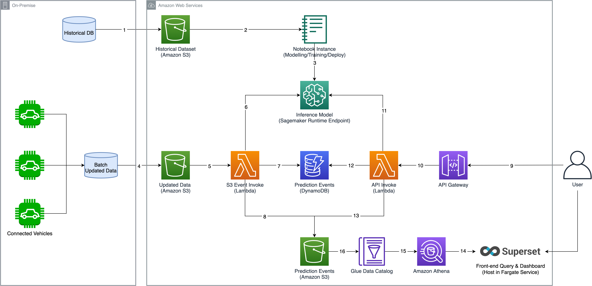

[中文](./README_CN.md)

# BEV BMS Battery Consistency Bias Alarm Prediction

## Table of contents
* [Introduction](#introduction)
* [Architect](#architect)
* [Deployment](#deployment)
  * [Things to Know](#things-to-know)
  * [Configuration Parameters](#configuration-parameters)
  * [Deploy via AWS Cloudformation](#deploy-via-aws-cloudformation)
  * [Deploy via AWS CDK](#deploy-via-aws-cdk)
* [Security](#security)
* [License](#license)

## Introduction
With Amazon S3, Amazon Lambda, Amazon SageMaker, Amazon DynamoDB and open-source Apache Superset, 
this solution offers machine learning developers and data scientists an entire tool chain for 
battery consistency bias alarm prediction in Battery Management System (BMS), including data 
storage, data analysis, feature engineering, model building, model training/inference and data 
visualization. This solution offers smooth work flow in the cloud without infrastructure capacity 
concerning, makes it easier to securely manage terabytes of data for battery and connected vehicle 
data to store and scale parallel algorithm training workloads to hundreds of cores in short time. 
It allows Original Equipment Manufacturer (OEM) to speed up developing process. Based on more BEV 
operation data, OEM can make more data analytics in different scenarios, for example, charging data, 
etc. 
"We need a tool chain to help us deal with data process and predicting." Said Kevin, 
Connected Vehicle Leader, Customer Digital Department in Volvo APAC. "This solution allows us 
to build an alert prediction platform in AWS with lacking of data analysis and scientists 
and obtain the expected result in POC."


## Architect


Detail process is described as below:

1. OEM or BEV battery vendors store battery data (captured with IoT, etc.) in S3 bucket.
1. Sagemaker notebook instance obtain dataset from S3 bucket, which could be used for model training. 
1. Complete model building, model training and model deployment. It outputs a  runtime endpoint, which is used to provide inference service.
1. Scenario 1: connected vehicles upload battery data (batch data) to S3 bucket.
1. Scenario 1: S3 bucket create event invoke lambda function.
1. Scenario 1: lambda function invokes the deployed sagemaker endpoint, perform inference on the uploaded batch data.
1. Scenario 1: batch inference results are written into dymanodb.
1. Scenario 1: batch inference results are written into S3 for superset visualization.
1. Scenario 2: user invokes the prediction service via HTTP POST request.
1. Scenario 2: API gateway route the request to lambda function.
1. Scenario 2: lambda function invokes the deployed sagemaker endpoint, perform inference with the post data as input.
1. Scenario 2: API single inference results are written into dymanodb.
1. Scenario 2: API single inference results are written into S3 for superset visualization.
1. Superset is host with Fargate service, users can access inference results using SQL query.
1. Athena query inference events from Glue Data Catalog.
1. The table defined in Glue Data Catalog describes the schema of inference events which are stored in S3 bucket.


## Deployment

#### Things to Know:

- The deployment will automatically provision resources like S3, API Gateway, Lambda, Dynamodb table, ECS Fargate Service, Sagemaker notebook, Glue Data Catalog table in your AWS account, etc.
- The deployment will take approximately 5-10 minutes.


#### Configuration Parameters

The following is the parameter for deployment:

| Parameter                 | Default                                             | Description                                                                                     |
|---------------------------|-----------------------------------------------------|-------------------------------------------------------------------------------------------------|
| sagemakerEndpointName     | battery-consistency-bias-alarm-prediction-endpoint  | Sagemaker runtime endpoint, should be same with the configuration in Sagemaker notebook script. |


#### Deploy via AWS Cloudformation

Please follow below steps to deploy this solution via AWS Cloudformation.

1. Sign in to AWS Management Console, switch to the region to deploy the CloudFormation Stack to.

1. Click the following button to launch the CloudFormation Stack in that region.

    - For Standard Partition

    [](https://console.aws.amazon.com/cloudformation/home#/stacks/create/template?stackName=BatteryConsistencyBiasAlarmPrediction&templateURL=https://aws-gcr-solutions.s3.amazonaws.com/Amazon-bev-bms-battery-consistency-bias-alarm-prediction/latest/AwsBevBmsBatteryConsistencyBiasAlarmPredictionStack.template)

    - For China Partition

    [](https://console.amazonaws.cn/cloudformation/home#/stacks/create/template?stackName=BatteryConsistencyBiasAlarmPrediction&templateURL=https://aws-gcr-solutions.s3.cn-north-1.amazonaws.com.cn/Amazon-bev-bms-battery-consistency-bias-alarm-prediction/latest/AwsBevBmsBatteryConsistencyBiasAlarmPredictionStack.template)

1. Click **Next**. Change the stack name if required.

1. Click **Next**. Configure additional stack options such as tags (Optional). 

1. Click **Next**. Review and confirm acknowledgement,  then click **Create Stack** to start the deployment.

> Note: You can simply delete the stack from CloudFormation console if this solution is no longer required.

#### Deploy via AWS CDK

If you want to use AWS CDK to deploy this solution, please make sure you have met below prerequisites:

* [AWS Command Line Interface](https://aws.amazon.com/cli/)
* Node.js 12.x or later

Under the project **source** folder, run below to compile TypeScript into JavaScript. 

```
cd source
npm install -g aws-cdk
npm install && npm run build
```

Then you can run `cdk deploy` command to deploy the solution. Please specify the parameter value if needed, for example:

```
cdk deploy --parameters sagemakerEndpointName=<your_sagemaker_runtime_endpoint>
```

> Note: You can simply run `cdk destroy` if the solution task is no longer required. This command will remove the stack created by this solution from your AWS account.


## Security
See [CONTRIBUTING](CONTRIBUTING.md#security-issue-notifications) for more information.

## License
This library is licensed under the MIT-0 License. See the LICENSE file.

